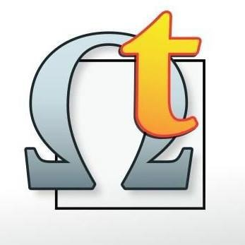

>? Version info?

>? omegat Logo

Welcome to the OmegaT bootcamp! This is a self-paced [OmegaT](https://omegat.org/) user guide for language experts and project managers, brought to you by [cApStAn](https://www.capstan.be).

This is an online book initially conceived and developed to train cApStAn's subcontractors (language experts, translators, reviewers and verifiers) and partners who work in OmegaT. However, it is free to use for anyone interested in learning to use OmegaT, from zero to zen.

The purpose of this resource is to create a guide that is clear, simple, easy to read and easy to understand for users who are not necessarily tech-savvy, so that the experience of working in OmegaT can be smooth and pleasurable.

You can read sequentially from beginning to end, browse through on the table of contents on the sidebar, or search by keywords. You can also download it as PDF or ePUB (to read in your eReader device) but we encourage you to refer to the book online as updates might be frequent.

Contributions (suggestions for better wording, new topics, flagged typos or errata, etc.) are also welcome.
